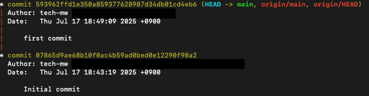

# detached HEAD状態の動作検証：non-fast-forward
## 検証目的
- HEADの仕組みと挙動を理解するために、意図的に detached HEAD状態 を作成 
- TerminalとSourceTreeでの表示の違いを観察 
- 実務で使う機会は少ないが、Git内部の動き理解のために有益 
- 「意図的にdetached HEAD」「git push origin HEAD:main」は実務では稀だと思います（今回はdetached HEAD を検証するため）

## 検証内容
- 通常の main でコミット → push 
- HEAD~0 に checkout（detached HEAD状態） → その状態でファイル更新 → commit 
- git push origin HEAD:main により、mainブランチをdetached HEAD状態で上書き 
- main に戻って再度 commit（ローカルとリモートが分岐） 
- git push による non-fast-forward エラーを確認 
- git pull --no-rebase → コンフリクト解消 → mergeコミットで履歴統合

## detached HEAD とは
HEAD がブランチではなくコミット（もしくはタグ）を直接指している状態

## --no-rebase
今回は「履歴を直線化せず、mergeコミットとして分岐を可視化したまま統合」する方法として –no‑rebase を採用しました

## detached HEAD 〜 分岐 〜 mergeで統合
### ファイル作成 + add + commit
1. `$ echo "local" > file.txt`  
2. `$ git add .`  
3. `$ git commit -m "first commit"`
- リモートにはまだpushしていないため HEAD → main が先に進んでいる状態
<pre>
HEAD→main
origin/HEAD, origin/main
</pre>


### push
1. `$ git push`
- リモートpush済。HEAD → main、 origin/HEAD, origin/mainが同じコミットIDを参照している状態（同じ位置）
<pre>
HEAD → main、origin/HEAD, origin/main
</pre>



### detached HEAD + HEADでファイル更新 + add + commit

1. `$ git checkout HEAD~0 # 現在の HEAD が指しているコミットに そのままチェックアウト`
2. `$ echo "local（HEAD） update" >> file.txt`  
3. `$ git add .`  
4. `$ git commit -m "HEAD（detach） to file update"`
- HEADとmainが分離した事が確認できる
  - （Terminal上での表示）HEAD → main ではなくHEAD と main に別れている
  - （SourceTree）レフトメニュー内の「ブランチ」でmainとHEADが表示され、HEADにチェックアウトしている
- HEAD、main、origin/HEAD, origin/mainが同じコミットIDを参照している状態（位置は変わらず同じ位置）
<pre>
HEAD、main、origin/HEAD, origin/main
</pre>


### （HEADにcheckoutしている状態）origin/mainにpush
```
# HEADをorigin/mainにpush
$ git push origin HEAD:main
```
- HEAD, origin/main, origin/HEADが先に進み、mainだけが遅れている状態
  - （Terminal上での表示）HEADをorigin/mainにpushしたのでorigin/HEADもorigin/mainに追従して同じ位置
  - （SourceTree）mainで[1コミット遅れ]になっている（mainだけが遅れている状態）
<pre>
HEAD、origin/HEAD, origin/main
main
</pre>


### mainにチェックアウト
`$ git checkout main`
- origin/main, origin/HEADが先行、HEAD → mainが遅れている状態
  - main にcheckoutしたので再び HEAD → main となる
  - HEAD → main だが main はリモート先行分を取り込んでいないため1コミット遅れ
<pre>
origin/HEAD, origin/main
HEAD → main
</pre>


### mainでファイル更新 + commit + push
1. `$ echo "local main update" > file.txt`  
2. `$ git add .`
3. `$ git commit -m "main file update"`
・push時に`![rejected]  main -> main (non-fast-forward)`エラー（原因（non-fast-forward））
（この時点で分岐が発生する）
<pre>
A---B---C  ← origin/main
     \
      \
       D  ← main (ローカルの新しいコミット)
A：07865d9（Initial commit）
B：593962f（first commit）
C：7eedc60（HEAD detachで作成しpushされたコミット）
D：88954a6（mainブランチ上での新しいコミット）

ローカルとリモートが「B」から分岐し、それぞれの履歴（CとD）を持っている
この状態で push すると、Gitはどちらか一方の履歴を失う可能性があると判断し、拒否する（non-fast-forward）
</pre>


### mainでpull + --no-rebase + コンフリクト修正 + add + commit push
1. `$ git pull --no-rebase # 今回は履歴が残る --no-rebaseを採用`  
2. コンフリクトを解消する  
3. `$ git add .`  
4. `$ git commit -m "Merge origin/main into local main"`
5. `$ git push"`
<pre>
（--no-rebase実行前）
A---B---C  ← origin/main
     \
      \
       D  ← main (ローカルの新しいコミット)
A：07865d9（Initial commit）
B：593962f（first commit）
C：7eedc60（HEAD detachで作成しpushされたコミット）
D：88954a6（mainブランチ上での新しいコミット）

↓↓↓

（--no-rebase実行後）
A---B---C---------M   ← main（HEAD）, origin/HEAD, origin/main
       \         /
        \       /
         \-----D
M：12e1549（mergeコミット。「Merge origin/main into local main」）
</pre>
[--no-rebase実行前]


[--no-rebase実行後]


