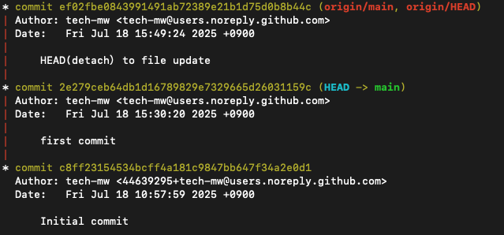
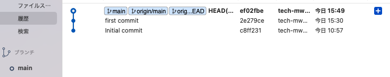

# detached HEAD状態の動作検証：fast-forward
## 検証目的
- HEADの仕組みと挙動を理解するために、意図的に detached HEAD状態 を作成 
- TerminalとSourceTreeでの表示の違いを観察 
- 実務で使う機会は少ないが、Git内部の動き理解のために有益 
- 「意図的にdetached HEAD」「git push origin HEAD:main」は実務では稀だと思います（今回はdetached HEAD を検証するため）
- fast-forward がどのように発生し、どのように統合されるかを段階的に検証

## 検証内容
- main ブランチでローカルコミット → push 
- HEAD~0 に checkout → detached HEAD状態へ移行 
- 分離状態で変更 → commit → git push origin HEAD:main 
- main に戻ってもローカルの HEAD はリモート（origin/main）より1コミット遅れているが、履歴は直線的で分岐していない
- main は origin/main より1コミット遅れているが、履歴が直線的に繋がっているため、git merge origin/main を実行すると fast-forward merge が行われる

## fast-forward
- fast-forward（早送り）mergeとは、現在のブランチが遅れており、かつ分岐がない直線的な履歴である場合に、単純に先に進める形で統合できる状態
- 今回のように、detached HEAD で更新した変更を先に push し、その後 main に戻ると、main は origin/main より1コミット遅れている状態になる。 ただし履歴は分岐していないため、git merge origin/main を実行することで fast-forward mergeが行われ、mergeコミットなしで履歴が直線的に統合される。

## detached HEADで更新 → push → mainブランチでfast-forward merge
### （main）ファイル作成 + add + commit
1. `$ echo "local" > file.txt`  
2. `$ git add .`  
3. `$ git commit -m "first commit"`
- リモートにはまだpushしていないため HEAD → main が先に進んでいる状態
<pre>
HEAD → main
origin/HEAD, origin/main
</pre>


### （main）push
1. `$ git push`
- リモートpush済。HEAD → main、 origin/HEAD, origin/mainが同じコミットIDを参照している状態（同じ位置）
<pre>
HEAD → main、origin/HEAD, origin/main
</pre>


### detached HEAD + HEADでファイル更新 + add + commit

1. `$ git checkout HEAD~0 # 現在の HEAD が指しているコミットに そのままチェックアウト`
2. `$ echo "local(HEAD） update" >> file.txt`  
3. `$ git add .`  
4. `$ git commit -m "HEAD(detach）to file update"`
- HEADとmainが分離した事が確認できる
  - （Terminal上での表示）HEAD → main ではなくHEAD と main に別れている
  - （SourceTree）レフトメニュー内の「ブランチ」でmainとHEADが表示され、HEADにチェックアウトしている
- HEAD、main、origin/HEAD, origin/mainが同じコミットIDを参照している状態（位置は変わらず同じ位置）
<pre>
HEAD、main、origin/HEAD, origin/main
</pre>


### （HEADにcheckoutしている状態）origin/mainにpush
```
# HEADをorigin/mainにpush
$ git push origin HEAD:main
```
- HEAD, origin/main, origin/HEADが先に進み、mainだけが遅れている状態
  - （Terminal上での表示）HEADをorigin/mainにpushしたのでorigin/HEADもorigin/mainに追従して同じ位置
  - （SourceTree）mainで[1コミット遅れ]になっている（mainだけが遅れている状態）
<pre>
HEAD、origin/HEAD, origin/main
main
</pre>


### mainにチェックアウト
`$ git checkout main`
- origin/main, origin/HEADが先行、HEAD → mainが遅れている状態
  - main にcheckoutしたので再び HEAD → main となる
  - HEAD → main だが main はリモート先行分を取り込んでいないため1コミット遅れ
<pre>
origin/HEAD, origin/main
HEAD → main
</pre>



### （main）fast-forwardをmergeで統合
- リモートが1コミット先に進んでいただけ（fast-forward）なので、ローカル main で merge を実行するだけで解決
<pre>
[merge実行前（fast-forward）]
c8ff231  ← Initial commit
   ↓
2e279ce  ← HEAD → main（ローカル）
   ↓
ef02fbe  ← origin/main, origin/HEAD

↓↓↓↓↓
[merge実行後]
c8ff231
   ↓
2e279ce
   ↓
ef02fbe  ← HEAD → main, origin/main, origin/HEAD
</pre>


