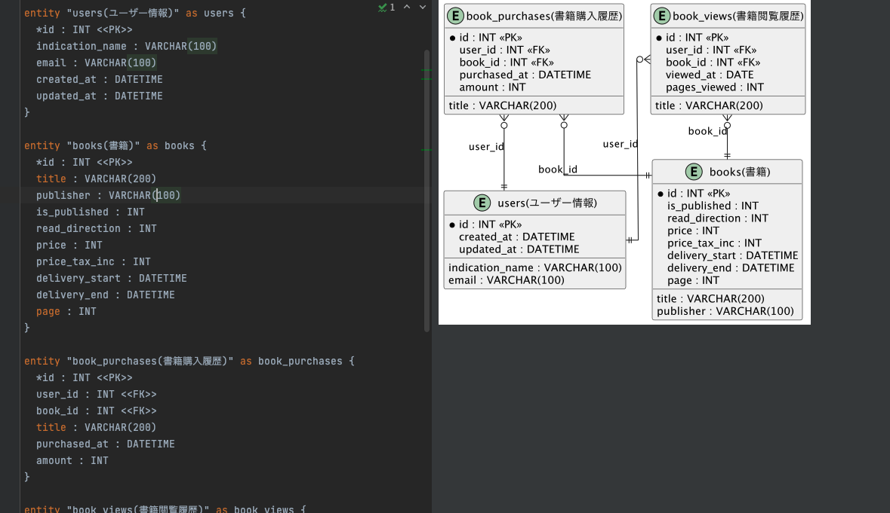
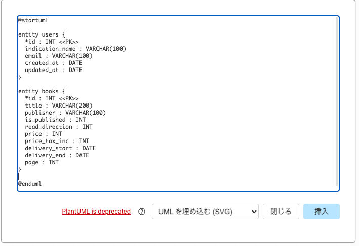
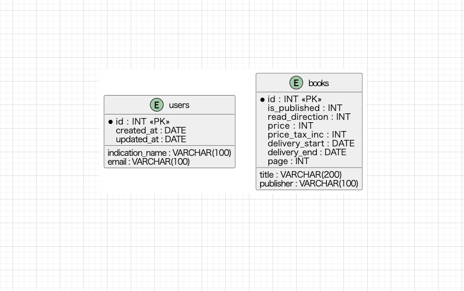

# Ebook-Schema Mysql Docker

MySQL の公式イメージを用いて Docker 上に構築した、簡易的な電子書籍アプリを想定したデータモデルと SQL サンプルです。  
初期データも自動で流し込まれ、すぐに演習・検証が行えます。

---

## 概要
- MySQL（公式イメージ）を使用し、Docker で即起動できる構成
- 電子書籍アプリを想定した4つのテーブル：
  - ユーザー情報（users）
  - 書籍情報（books）
  - 書籍購入履歴（book_purchases）
  - 書籍閲覧履歴（book_views）
- 初期データを流し込み済み
- 実務的な SQL 演習付き
  - 例：**「期間内に特定の出版社の書籍を購入したユーザーごとの合計金額」**など

### mysqlコンテナ起動
```bash
docker compose up -d
```
### mysql接続
### コンテナ経由
```bash
docker exec -it mysql_container mysql -u development -p --default-character-set=utf8mb4
```
### ホストOSから(brewなど)
```bash
mysql -h 127.0.0.1 -P 4036 -u root -p
```

## pumlファイル表示方法
- pycharm上でプラグイン拡張でのリアルタイムプレビュー もしくは draw.io上でコード埋込の2パターンがあります

### pycharm上でプラグイン拡張でのリアルタイムプレビュー
- 必要なものは①PlantUML Integration②graphviz
1. pycharm > settings > Plugins で **PlantUML Integration**をインストール+有効化
2. `$ brew install graphviz`（brewが入っている事前提）
3. `$ dot -V`でインストールが完了したか確認
4. `.puml`形式ファイル作成（画面分割でプレビューが表示）


### draw.io上でコード埋込
- [drawio](https://www.drawio.com/) > 配置 > 挿入 > 高度な設定 > UMLを埋め込む
  - draw.io の UMLエンジンは一部構文にしか対応していないため、pycharmではエラーなく表示されるにも関わらずdrawio上ではエラーになる事があります
  - 上記理由のためpycharmなどでリアルタイムプレビューが良さそうです。導入も簡単なので。

