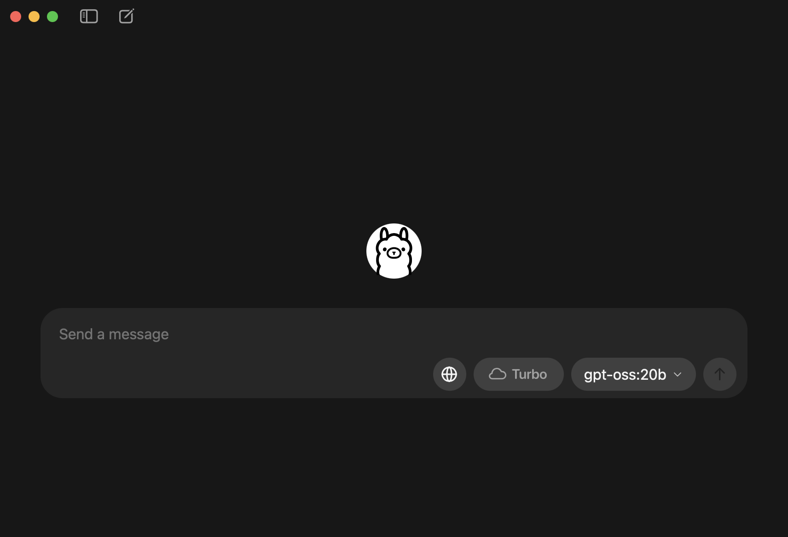

# django-llm-summary-notes
Django（CBV） × TextRank での要約生成メモアプリです。
メモには「タイトル・本文・要約」を保存でき、要約は TextRank による自動生成、Bootstrap を用いたカード型UIと フラッシュメッセージで、軽快に操作できます。

---

## 技術スタック
- Backend: Django (CBV)
- Frontend: Bootstrap 5.3
- Database: SQLite 
- Auth: Django Auth
- NLP: sumy (TextRank Summarizer)
- LLM: Ollama（ローカルLLM/生成要約）

---

## 主な機能
### 現在の主な機能
- メモの作成 / 編集 / 削除（CRUD） 
  - 作成時：保存時に要約（抽出型）を自動生成
- 一覧表示（カードレイアウト）
  - ページネーション対応（最大表示数20）
- フラッシュメッセージ
- 検索機能
- 認証機能（個人） 
  - 未ログイン時は認証画面へ誘導
- 単体テスト（unittest）
### 追加予定
- URL貼り付けからの要約生成
- サインアップ（複数ユーザー利用）
- など

---

## 想定ユースケース
海外の面白ガジェットなどを見つけた際のメモや翻訳、要約、会議中の議事録メモなど、**情報の取捨選択が必要なメモ管理**を想定しています。個人向け

---

## セットアップ手順
```
# 仮想環境の作成
$ python3 -m venv venv

# 仮想環境の有効化
$ source ./venv/bin/activate

# 必要なパッケージのインストール
$ pip install -r requirements.txt

# .envファイル作成
$ echo "SECRET_KEY='任意の文字列'" > .env

# マイグレーション
$ python3 manage.py migrate

# 管理ユーザー作成
$ python3 manage.py createsuperuser

# サンプルデータ投入（任意）
$ python3 manage.py loaddata notes/fixtures/notes_sample.json

# サーバー起動
$ python3 manage.py runserver

# ブラウザで http://localhost:8000/ にアクセス
```

---

## 要約生成について
- 既定は 抽出要約（TextRank） 
- Ollama が起動中なら 生成要約に切り替わります。未起動時は自動で抽出要約にフォールバックします。 
- 初回呼び出しや 7B モデル 使用時は数秒〜十数秒かかることがあります

---

## ローカルLLM：Ollama を Docker で使う
```
・イメージ作成（7B などをビルド時に pull する Dockerfile を用意）
$ docker build -t my-ollama .

・起動（ボリューム無：使い終わったら消す）
（ollamaはデフォルトでポート11434を利用する仕様）
$ docker run -d --name ollama -p 11434:11434 my-ollama

・稼働確認
$ curl -s http://127.0.0.1:11434/api/version
$ curl -s http://127.0.0.1:11434/api/tags

・コンテナ内のollamaのモデルを確認
$ docker exec -it ollama ollama list
# qwen2.5:7b-instruct と表示されればOK

※7B はメモリ消費大（Docker Desktop の Resources → Memory を 8GB+ 推奨）足りない場合は 3B を利用するかネイティブ起動をご検討ください
容量不足メッセージが出た場合は下記コマンドでDocker側メモリ容量を確認
$ docker exec -it ollama free -h
```

---

## ローカルLLM：Ollama を GUIアプリで使う
- アプリインストール：`brew install --cask ollama`
- アプリケーションを立ち上げる（アプリを立ち上げると下記のような画面が確認できます。この状態でcurlコマンドで稼働確認できればOK）


---

## Docker Desktopで容量を増やす
- Docker Desktop > settings（歯車アイコン） > Resource > Memory: 8.00 GB に変更

---

## 現在の構成
<pre>
.
├── config
│   ├── __init__.py
│   ├── asgi.py
│   ├── settings.py
│   ├── urls.py
│   └── wsgi.py
├── db.sqlite3
├── Dockerfile
├── images
│ └── app_ollama.png
├── manage.py
├── notes
│   ├── __init__.py
│   ├── admin.py
│   ├── apps.py
│   ├── fixtures
│   │   └── notes_sample.json
│   ├── forms.py
│   ├── migrations
│   │   ├── __init__.py
│   │   └── 0001_initial.py
│   ├── models.py
│   ├── static
│   │   └── notes
│   │       └── css
│   │           ├── common.css
│   │           └── signin.css
│   ├── templates
│   │   ├── 404.html
│   │   └── notes
│   │       ├── base.html
│   │       ├── form.html
│   │       ├── note_confirm_delete.html
│   │       ├── note_list.html
│   │       ├── note_signin.html
│   │       ├── paging.html
│   │       └── spinner.html
│   ├── tests
│   │   ├── __init__.py
│   │   └── test_note.py
│   ├── urls.py
│   ├── util
│   │   └── summarizer.py
│   └── views.py
├── README.md
└── requirements.txt
</pre>

---

## 各画面イメージ
### デモ01
- サインイン：表示〜ログイン
- 一覧：ページネーション

<video src="https://github.com/user-attachments/assets/07e16250-6f5b-408f-aec3-c9963f88b489" width="720" controls="true"></video>

### デモ02
- 一覧：表示
- 新規作成：バリデーション〜投稿（要約作成/生成型）
- 一覧：メッセージ表示
- 一覧：検索

<video src="https://github.com/user-attachments/assets/ac63a7d9-53ff-4938-b528-fa4e0231da5d" width="720" controls="true"></video>

### デモ03
- 一覧：表示
- 編集：表示〜更新（要約作成/生成型）
- 一覧：メッセージ表示
- 編集：表示

<video src="https://github.com/user-attachments/assets/e03ead37-6f2b-4c23-b71d-facf645570a7" width="720" controls="true"></video>

### デモ04
- 一覧：表示
- 削除：表示 〜 確認 〜 削除
- 一覧：メッセージ表示 〜 サインアウト
- サインイン：表示

<video src="https://github.com/user-attachments/assets/d4aa280b-914b-4285-a4ef-e14091d8d59e" width="720" controls="true"></video>

### デモ05
- 一覧：表示
- 新規作成：表示 〜 投稿（要約作成/抽出型）※ docker/ollamaを停止しているため要約は生成型ではなく抽出型となる
- 一覧：メッセージ表示

<video src="https://github.com/user-attachments/assets/f9456f5d-f9a5-40db-b6c2-e5419032d874" width="720" controls="true"></video>
